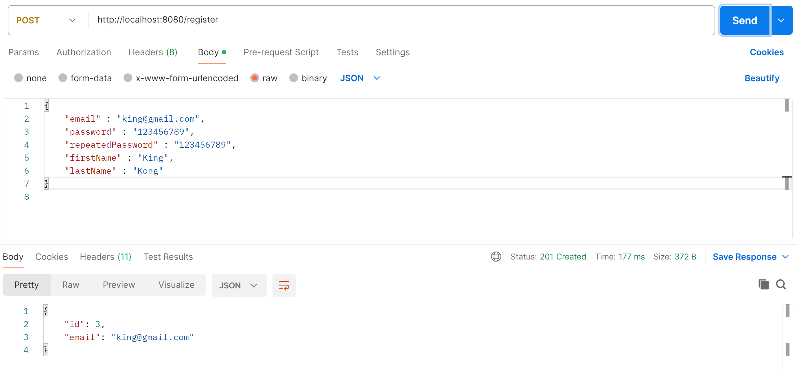
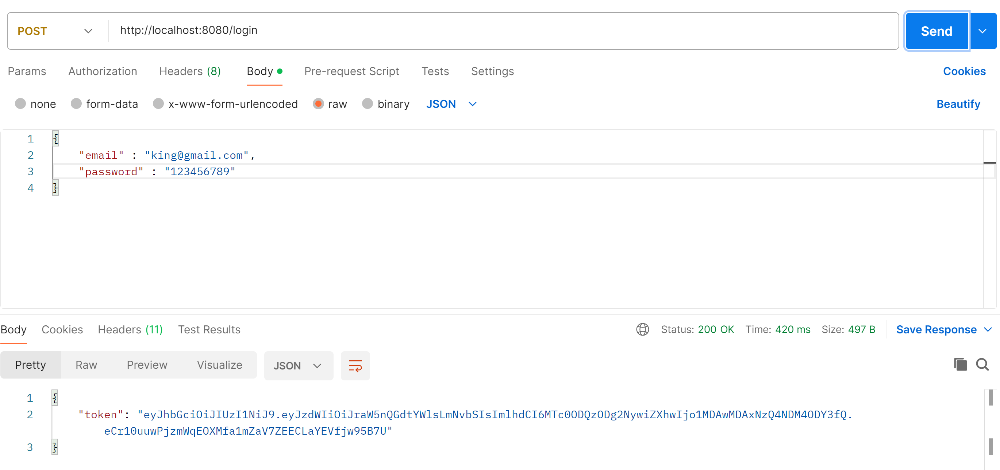
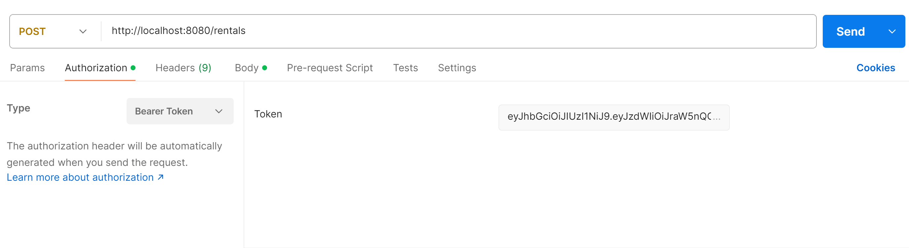
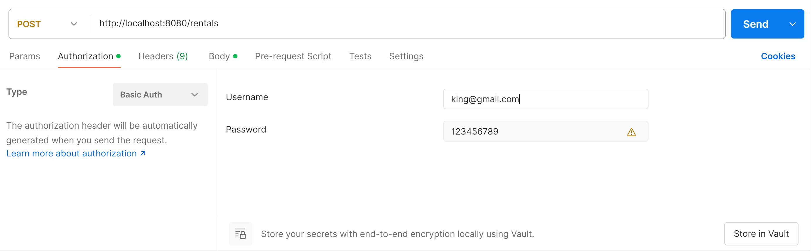
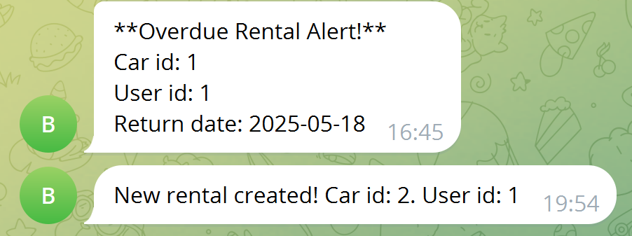
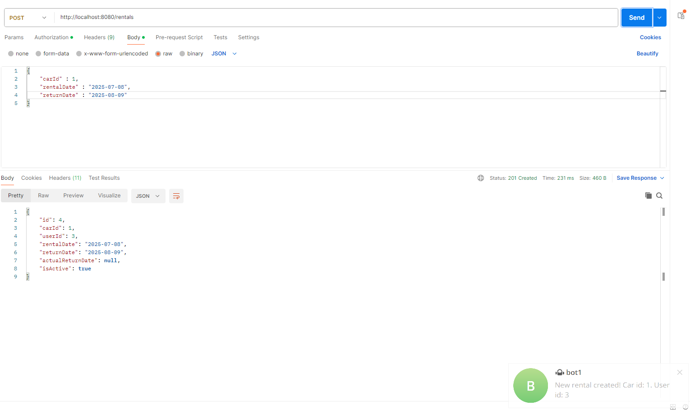

Car sharing app is an app written in Java, which allows us to manage a car rental service.

The project uses many technologies and tools like:
- Docker
- Dotenv
- Hibernate
- Liquibase
- Lombok
- Mockito
- Spring Boot
- Spring Data JPA
- Spring Security
- Stripe API
- Telegram API

Car sharing app is divided into many packages:
- config
- controller
- dto
- exception
- mapper
- model
- security
- service

Besides that, there is also a resource package which contains liquibase database creation along with many data. I also created a lot of tests using
Mockito, SpringBootTest and DataJpaTest to test controller, repository and service with Car, Payment, Rental and User classes.

In order to use car sharing app, you need to install a program for managing endpoints like Postman which I will use to show you how to use my app.
First of all, go to application.properties file and liquibase.properties and change credentials for user and password to match
yours in your database. I am using MySql in this project. On your local computer, you should also create database called
"car_sharing_app". This will ensure that you will connect with your local database, and allow liquibase to fill it with data.
After starting application, launch Postman, and type in your http local host address. By default it is: "http://localhost:8080".
At first, register new user using /register endpoint with @PostMapping.

Registration requires from user to type in email, password, repeated password, first name and last name. There are two roles for users: customer and manager.
Creating new user gives customer role, which is also required for selected endpoints. If you want to login as manager, you can
use credentials that I used to create one in liquibase. The location is "src/main/resources/db/changelog/changes/add-new-users.yaml".
If you want to create your own admin, you should do it directly in your database or add new admin in liquibase.

Once you register, you can login using /login endpoint. This will generate token, which you can use
to access other endpoints.

To use endpoint which requires login authorization, choose bearer token and paste your generated token.

However you can also login using basic auth as authorization instead of token.

You will find all endpoints in controller package, which is divided into Authentication, Car, Payment, Rental and
User. Some of them requires to use @RequestBody of certain class or record. You will find them in dto package.
JwtUtil class is used mainly for generating tokens while JwtAuthenticationFilter checks if token is valid. I have set
very long time for token expiration, which helped for testing and creating this app, but you can change it in application.properties file (jwt.expiration).

I have implemented Stripe API and Telegram API in this project. In order to use it, you have to type in your Stripe API key,
Telegram botToken and Telegram chatId. To do that you need to login into Stripe and Telegram account. Add them in .env file.
They should be named: "STRIPE_API_KEY", "TELEGRAM_CHAT_ID", "TELEGRAM_BOT_TOKEN". Dotenv is used for getting these values from
.env file. Stripe generates sessions for payments which can be successful ar cancelled. Telegram gives us a notification everyday,
about which rentals are overdue. You can change it how often you want the notification in RentalOverdueCheckServiceImpl. Some endpoints gives
a notification on Telegram like adding a new rental. They will appear on Telegram chat with your bot.

This app also supports Docker. The configuration is in Dockerfile and docker-compose.yaml. You can also use your credentials stored in .env file.
It uses port 8081 so remember to change it in Postman if you are running app through Docker.
If you want to run it, you can use this command in terminal:
docker run --network my_network -p 8081:8080 -e SPRING_DATASOURCE_URL=jdbc:mysql://host.docker.internal:3306/book_app -e SPRING_DATASOURCE_USERNAME=root -e SPRING_DATASOURCE_PASSWORD=password your-image-name
or type in this command which will use your credentials from .env file: docker run --env-file .env -p 8081:8081 your-image-name

Below you can watch a video of me explaining how to use my app:
https://youtu.be/PPL06Oi-_HE